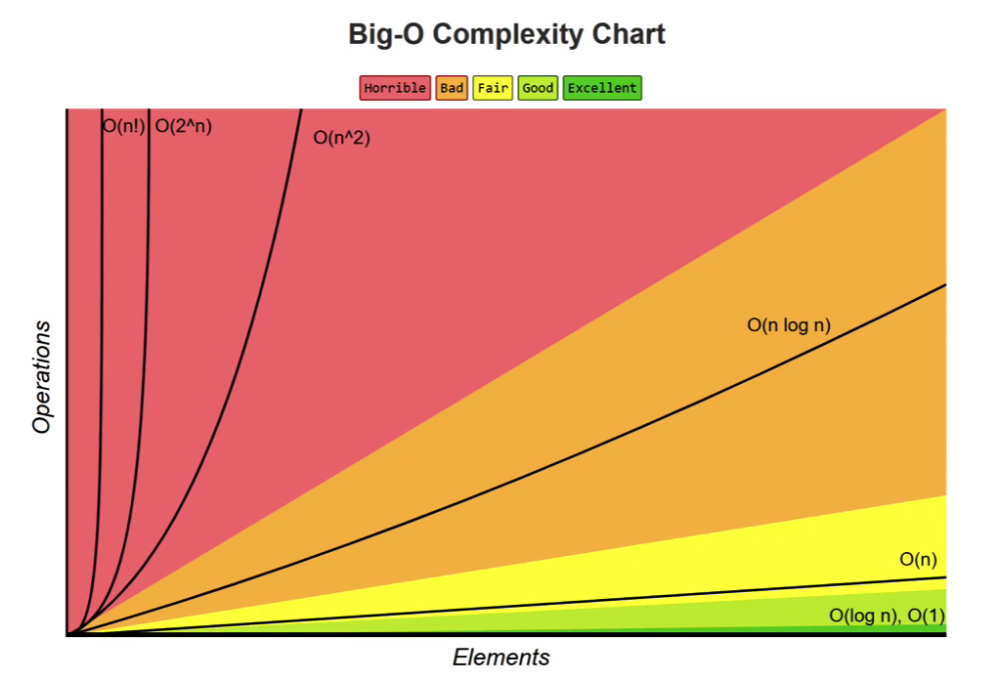

# 📈 Big-O Notation

## What is Big-O?

**Big-O notation** represents the **worst-case time complexity** of an algorithm.

---

## Purpose

Big-O describes the complexity of an algorithm using **algebraic expressions**.

---

## Characteristics

- Expressed in terms of the **input size (`n`)**.
- Focuses on the **overall growth** of an algorithm, ignoring small constant details.

---

## Example

Instead of saying:

```text
Time = 3n + 4
```

Big-O focuses on the part that grows the fastest:

```text
O(n)
```

Because as `n` becomes very large, the constant `3` and the `+4` become insignificant.

---

## Key Idea

Big-O tells us **how an algorithm grows as the input size (`n`) increases**, not the exact running time.

---

# 📈 Big-O Example: O(n)

```js
function summation(n) {
  let sum = 0;

  for (let i = 1; i <= n; i++) {
    sum += i;
  }

  return sum;
}
```

### Step 1: Count the Operations

```text
let sum = 0        → 1 time

for loop
    i = 1          → 1 time
    i <= n         → n + 1 times
    i++            → n times
    sum += i       → n times

return sum         → 1 time
```

### Step 2: Total Operations

```text
1 + 1 + (n + 1) + n + n + 1

= 3n + 4
```

### Step 3: Convert to Big-O

Ignore:

- Constant coefficients
- Lower-order terms

```text
3n + 4
   ↓

O(n)
```

---

## Why Do We Ignore Constants?

Big-O focuses on the **overall growth** of an algorithm.

Consider:

```text
n + 2
```

As `n` grows:

```text
n = 10
10 + 2 = 12

n = 100
100 + 2 = 102

n = 1,000
1000 + 2 = 1002

n = 10,000
10000 + 2 = 10002

n = 1,000,000
1000000 + 2 = 1000002
```

The `+2` becomes insignificant compared to `n`.

Therefore:

```text
n + 2
  ↓

O(n)
```

The same applies to:

```text
3n + 4
   ↓

O(n)
```

---

# ⏱️ O(1) — Constant Time

```js
function summation(n) {
  return (n * (n + 1)) / 2;
}

console.log(summation(4));
```

### Time Complexity

```text
O(1)
```

The number of operations stays the **same**, regardless of the input size.

```text
n = 10          → 1 operation
n = 100         → 1 operation
n = 1,000       → 1 operation
n = 1,000,000   → 1 operation
```

This is called **Constant Time**.

---

# 📈 O(n) — Linear Time

```js
for (let i = 0; i < n; i++) {
  // some code
}
```

### Time Complexity

```text
O(n)
```

The number of operations grows **proportionally** with the input size.

```text
n = 10          → ~10 operations
n = 100         → ~100 operations
n = 1,000       → ~1,000 operations
```

This is called **Linear Time**.

---

# 📈 O(n²) — Quadratic Time

```js
for (let i = 0; i < n; i++) {
  for (let j = 0; j < n; j++) {
    // some code
  }
}
```

### Time Complexity

```text
O(n²)
```

Operation count example:

```text
3n² + 5n + 1
```

Big-O ignores the smaller terms and constants:

```text
3n² + 5n + 1
      ↓

O(n²)
```

This is called **Quadratic Time**.

---

# 📈 O(n³) — Cubic Time

```js
for (let i = 0; i < n; i++) {
  for (let j = 0; j < n; j++) {
    for (let k = 0; k < n; k++) {
      // some code
    }
  }
}
```

### Time Complexity

```text
O(n³)
```

This is called **Cubic Time**.

---

# 📈 O(log n) — Logarithmic Time

An algorithm has **O(log n)** time complexity when the input size is **reduced by half** during each iteration.

Example:

```text
16
↓
8
↓
4
↓
2
↓
1
```

The larger the input becomes, the slower the number of steps grows.

This is called **Logarithmic Time**.

```text
O(log n)
```

---

# 💾 Space Complexity

Space complexity measures the amount of **memory** an algorithm uses as the input size grows.

### Common Space Complexities

| Complexity   | Description       |
| ------------ | ----------------- |
| **O(1)**     | Constant Space    |
| **O(n)**     | Linear Space      |
| **O(log n)** | Logarithmic Space |

---

# 📈 Big-O Trend

From fastest growth to slowest performance:

```text
Better 👍

O(1)
  │
  ▼
O(log n)
  │
  ▼
O(n)
  │
  ▼
O(n log n)
  │
  ▼
O(n²)
  │
  ▼
O(n³)

Worse 👎
```

Or using your image:

```md

```

---

# 📝 A Few Points to Note

- There are multiple algorithms that can solve the same problem.
- There is **no single best algorithm** for every situation.
- Different algorithms perform better under different constraints.
- The same algorithm can be implemented in different ways, even using the same programming language.
- When writing code, don't lose sight of the bigger picture.
- Prefer writing code that is **simple, readable, and maintainable** over clever but difficult-to-understand code.
